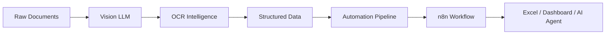

````md
<div align="center">


<br/>


</div>

---

#  Hey, I'm Bharath

```bash
> whoami

Bharath Abhinesh A

AI Systems Engineer • Full Stack Builder • Data Analyst

Specializing in:
→ Generative AI Systems
→ Vision Language Models
→ Local LLM Orchestration
→ Agentic Workflows
→ Intelligent Automation

Mission:
Build privacy-first intelligent systems
that work offline, fast, and efficiently.
````

---

## ⚡ Current Focus

```txt
[███████████░░] DeepXmeD v2                (82%)
[█████████░░░░] VisionAgent-OCR            (68%)
[███████░░░░░░] Multi-Agent Systems        (51%)
[█████░░░░░░░░] AI Desktop Applications    (38%)
```

---

## 🧠 About Me

```python
class BharathAbhinesh:

    def __init__(self):
        self.name = "Bharath Abhinesh A"
        self.alias = "@bharathvk75"

        self.roles = [
            "AI Systems Engineer",
            "Full Stack Developer",
            "Data Analyst"
        ]

        self.specialization = {
            "Generative AI": [
                "RAG Systems",
                "Agentic Workflows",
                "LLM Orchestration"
            ],

            "Vision AI": [
                "OCR Pipelines",
                "Vision Language Models",
                "Document Intelligence"
            ],

            "Engineering": [
                "Automation Systems",
                "Cross-platform Apps",
                "Backend APIs"
            ]
        }

        self.current_mission = (
            "Building intelligent systems "
            "that are fast, local and autonomous."
        )

    def say_hi(self):
        print("Let's build something insane 🚀")
```

---

## 🏗️ System Architecture Mindset



---

# ⚙️ Technical Arsenal

## Programming Languages

<p align="center">


</p>

---

## Frameworks & Runtime

<p align="center">


</p>

---

## AI / ML / Automation

<p align="center">


</p>

---

# 🚀 Featured Projects

<table>
<tr>

<td width="50%">

## 🧠 DeepXmeD

### AI Medicine Intelligence Platform

* OCR Prescription Scanning
* AI Medicine Comparison
* Price Optimization
* Smart Healthcare Assistance

**Tech Stack**

```yaml
Frontend:
  - React
  - Framer Motion

AI:
  - OCR Intelligence
  - Vision Models

Backend:
  - Node.js
```

</td>

<td width="50%">

## 👁️ VisionAgent-OCR

### Document Intelligence Pipeline

* Handwritten OCR
* Excel Automation
* Local Vision LLMs
* Structured Data Extraction

**Tech Stack**

```yaml
Models:
  - Qwen2-VL
  - Gemma

Pipeline:
  - OCR
  - VLM
  - Excel Export
```

</td>

</tr>

<tr>

<td width="50%">

## 🎬 AniLiv

### Generative Story Visualization

Transforming raw novels and scripts into
AI generated animated storytelling.

```yaml
Features:
  - Scene Generation
  - Narrative Understanding
  - Auto Visualization
```

</td>

<td width="50%">

## 🔐 CipherVault

### Secure Password Intelligence

```yaml
Security:
  - AES-256 Encryption
  - Zero Knowledge
  - Secure Credential Storage

Automation:
  - n8n
  - Workflow Sync
```

</td>

</tr>
</table>

---

# 📊 GitHub Analytics

<div align="center">


</div>

---

<div align="center">


</div>

---

## 📈 Contribution Graph

<div align="center">


</div>

---

## 🐍 Contribution Snake

<div align="center">


</div>

---

## 🧪 Engineering Interests

```txt
AI Agents
Multi-Agent Systems
Vision-Language Intelligence
RAG Pipelines
Offline AI Systems
High Performance Applications
Cross Platform Engineering
Automation Workflows
Document Intelligence
Local LLM Ecosystems
```

---

## 🧰 Tech Matrix

| Domain         | Technologies                             |
| -------------- | ---------------------------------------- |
| AI/ML          | LangChain, Ollama, Transformers, PyTorch |
| Vision AI      | OCR, Vision LLMs, Document Parsing       |
| Backend        | Spring Boot, Node.js, Express            |
| Mobile         | React Native, Kotlin                     |
| Automation     | n8n, Webhooks, AI Agents                 |
| Infrastructure | Docker, Linux, GitHub Actions            |

---

## 🌐 Connect With Me

<div align="center">

<a href="https://linkedin.com/in/bharathvk75">

</a>

<a href="https://github.com/bharathvk75">

</a>

<a href="mailto:bharathvk75@gmail.com">

</a>

</div>

---

<div align="center">

### ⚡ Philosophy

> *“The best intelligence runs locally, privately, and exactly the way you designed it.”*

<br>


</div>
```

### Extra setup for animations (important)

For the **snake animation** to work:

1. Go to your repo → `.github/workflows/`
2. Create `snake.yml`

Use:

```yaml
name: Generate Snake

on:
  schedule:
    - cron: "0 */12 * * *"

  workflow_dispatch:

jobs:
  build:
    runs-on: ubuntu-latest

    steps:
      - uses: Platane/snk@v3
        with:
          github_user_name: bharathvk75
          outputs: |
            dist/github-contribution-grid-snake-dark.svg?palette=github-dark

      - uses: crazy-max/ghaction-github-pages@v4
        with:
          target_branch: output
          build_dir: dist
        env:
          GITHUB_TOKEN: ${{ secrets.GITHUB_TOKEN }}
```

This version looks much more **premium, technical, animated, recruiter-friendly, and less “generic AI portfolio”**.
