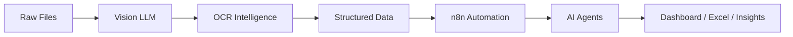

<div align="center">


<br>


</div>

---

<table>
<tr>

<td width="35%" align="center">


### 🧠 Bharath Abhinesh A

**AI Systems Engineer**  
**Full Stack Builder**  
**Data Analyst**

<br>

🟢 Building Intelligent Systems  
⚡ Agentic Workflow Engineer  
🧠 Local LLM Enthusiast  
🚀 Open Source Builder

<br>

<a href="https://truce95.dpdns.org/" target="_blank">

</a>

</td>

<td width="65%">

# 🚀 About Me

```bash
> whoami

bharath_abhinesh

AI Systems Engineer
Full Stack Developer
Data Analyst

Current Focus:
→ Generative AI Pipelines
→ Local LLM Orchestration
→ Agentic Workflows
→ Vision Language Models
→ Intelligent Automation

Mission:
Build privacy-first intelligent systems
that are fast, local, and autonomous.
```

</td>

</tr>
</table>

---

# ⚡ Current Build Dashboard

```txt
[███████████░░] DeepXmeD v2                (82%)
[█████████░░░░] VisionAgent OCR            (68%)
[███████░░░░░░] Multi-Agent Systems        (52%)
[█████░░░░░░░░] AI Desktop Applications    (39%)
```

---

# 🌐 Portfolio

<div align="center">

<a href="https://truce95.dpdns.org/" target="_blank">

</a>

<br><br>

<a href="https://truce95.dpdns.org/" target="_blank">


</a>

</div>

---

# 🏗 System Architecture Mindset



---

# ⚙️ Technical Arsenal

## 💻 Languages

<p align="center">

</p>

## ⚙️ Frameworks & Runtime

<p align="center">

</p>

## 🤖 AI / ML / Automation

<p align="center">


</p>

---

# 🚀 Featured Systems

| Project | Description |
|----------|-------------|
| 💊 **DeepXmeD** | AI-powered medicine intelligence with OCR prescription parsing & smart comparison |
| 👁 **VisionAgent-OCR** | Local Vision-LLM OCR pipeline using Qwen2-VL & Gemma |
| 🎬 **AniLiv** | Generative AI storytelling visualization engine |
| 🔐 **CipherVault** | Secure credential ecosystem with AES-256 & automation |

---

# 📊 GitHub Analytics

<div align="center">


</div>

<div align="center">


</div>

---

# 📈 Contribution Graph

<div align="center">


</div>

---

# 🌐 Connect With Me

<div align="center">

<a href="https://truce95.dpdns.org/">

</a>

<a href="https://github.com/bharathvk75">

</a>

<a href="mailto:bharathvk75@gmail.com">

</a>

</div>

---

<div align="center">

> *“Build intelligence, not just software.”*


</div>
