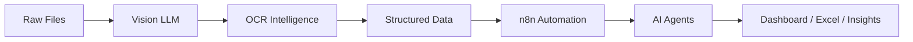

<div align="center">


<br>


</div>

---

<table>
<tr>

<td width="35%" align="center">


### Bharath Abhinesh A

**AI Systems Engineer**  
**Full Stack Builder**  
**Generative AI Developer**

<br>

🟢 **Currently Building AI Systems**  
🧠 **Local LLM Enthusiast**  
⚡ **Automation Engineer**  
🚀 **Open Source Builder**

</td>

<td width="65%">

# 🚀 About Me

```bash
> whoami

bharath_abhinesh

AI Systems Engineer
Full Stack Developer
Data Analyst

Current Focus:
→ Generative AI Pipelines
→ Local LLM Orchestration
→ Agentic Workflows
→ Vision Language Models
→ Intelligent Automation

Mission:
Build privacy-first intelligent systems
that are fast, local, and autonomous.
```

</td>

</tr>
</table>

---

# ⚡ Current Build Dashboard

```txt
[███████████░░] DeepXmeD v2                (82%)
[█████████░░░░] VisionAgent OCR            (68%)
[███████░░░░░░] Multi-Agent Systems        (52%)
[█████░░░░░░░░] AI Desktop Applications    (39%)
```

---

# 🏗 System Architecture Mindset



---

# ⚙️ Technical Arsenal

## 💻 Languages

<p align="center">

</p>

---

## ⚙️ Frameworks & Runtime

<p align="center">

</p>

---

## 🤖 AI / ML / Automation

<p align="center">


</p>

---

# 🚀 Featured Systems

<table>

<tr>

<td width="50%">

## 💊 DeepXmeD

### AI Medicine Intelligence Platform

AI-powered prescription intelligence system.

#### Features
✔ OCR Prescription Parsing  
✔ Medicine Comparison Engine  
✔ Smart Cost Analysis  
✔ Healthcare Intelligence

```yaml
Stack:
Frontend:
 - React
 - Framer Motion

Backend:
 - Node.js

AI:
 - OCR
 - LLM Intelligence
```

</td>

<td width="50%">

## 👁 VisionAgent-OCR

### Automated Vision Pipeline

```yaml
Models:
 - Qwen2-VL
 - Gemma

Pipeline:
 - OCR
 - VLM
 - Excel Export
```

#### Features
✔ Handwritten OCR  
✔ Invoice Intelligence  
✔ Structured Data Extraction  
✔ Automation Pipeline

</td>

</tr>

<tr>

<td width="50%">

## 🎬 AniLiv

### Generative Story Visualization

Transforming novels into animated visual storytelling.

✔ Narrative Understanding  
✔ Scene Generation  
✔ AI Animation

</td>

<td width="50%">

## 🔐 CipherVault

### Secure Password Ecosystem

✔ AES-256 Encryption  
✔ Zero-Knowledge Security  
✔ n8n Workflow Automation

</td>

</tr>

</table>

---

# 📊 GitHub Analytics

<div align="center">


</div>

---

<div align="center">


</div>

---

# 📈 Contribution Graph

<div align="center">


</div>

---

# 🐍 Contribution Snake

<div align="center">


</div>

---

# 🧠 Engineering Interests

```txt
AI Agents
Multi-Agent Systems
RAG Pipelines
Vision-Language Intelligence
Local LLM Systems
Document Intelligence
High Performance Applications
Cross Platform Engineering
Automation Workflows
```

---

# 🧰 Tech Matrix

| Domain | Technologies |
|--------|--------------|
| AI/ML | LangChain, Ollama, Transformers |
| Vision AI | OCR, VLMs, Document Parsing |
| Backend | Spring Boot, Node.js, FastAPI |
| Mobile | React Native, Kotlin |
| Automation | n8n, AI Agents |
| Infrastructure | Docker, Linux, GitHub Actions |

---

# 🌐 Connect With Me

<div align="center">

<a href="https://linkedin.com/in/bharathvk75">

</a>

<a href="https://github.com/bharathvk75">

</a>

<a href="mailto:bharathvk75@gmail.com">

</a>

</div>

---

<div align="center">

### ⚡ Philosophy

> *“The best intelligence runs locally, privately, and exactly the way you designed it.”*

<br>


</div>
