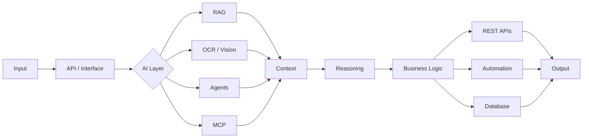

<div align="center">

<!-- ═══════════════════════════════════════════════════════════ -->

<!-- HERO -->

<!-- ═══════════════════════════════════════════════════════════ -->


<br>


<br><br>

<a href="https://bharathabhinesh.me">

</a>

<a href="https://github.com/bharathvk75">

</a>

<a href="https://www.linkedin.com/in/bharathvk75/">

</a>

<br><br>


</div>

---

<div align="center">

### `INITIALIZING BHARATH_ABHINESH...`


</div>

<br>

<!-- ═══════════════════════════════════════════════════════════ -->

<!-- IDENTITY -->

<!-- ═══════════════════════════════════════════════════════════ -->

<table>
<tr>

<td width="36%" align="center" valign="middle">


<br><br>


<br><br>

<a href="https://bharathabhinesh.me">

</a>

</td>

<td width="64%" valign="middle">

## `> whoami`

```text
┌─────────────────────────────────────────────────────┐
│                                                     │
│  Bharath Abhinesh A                                 │
│                                                     │
│  AI / ML Engineer                                   │
│  Computer Science & Engineering                     │
│                                                     │
│  Bengaluru, India                                   │
│                                                     │
│  I build:                                           │
│                                                     │
│  ◆ Multi-Agent AI Systems                            │
│  ◆ Retrieval-Augmented Generation                   │
│  ◆ Intelligent Automation                           │
│  ◆ Computer Vision & OCR                            │
│  ◆ Backend & REST API Systems                       │
│  ◆ AI-powered Business Workflows                    │
│                                                     │
└─────────────────────────────────────────────────────┘
```

<div align="center">


</div>

</td>

</tr>
</table>

---

<div align="center">


### `THE ENGINEERING LOOP`


</div>

---

# ⚡ What I Build

<table>
<tr>

<td width="33%" align="center">

### 🧠

**AI SYSTEMS**

<br>

Multi-Agent
RAG
LLM Applications
MCP
Vector Search

<br>

`REASON`

</td>

<td width="33%" align="center">

### ⚙️

**AUTOMATION**

<br>

AI Workflows
Document Processing
API Integration
Business Automation
n8n

<br>

`AUTOMATE`

</td>

<td width="33%" align="center">

### 👁️

**VISION**

<br>

Computer Vision
OCR
Image Processing
Edge AI
Real-Time Inference

<br>

`PERCEIVE`

</td>

</tr>
</table>

---

<div align="center">

## 🔄 AI SYSTEM FLOW

```text
                     ┌──────────────┐
                     │     INPUT    │
                     └──────┬───────┘
                            │
                            ▼
                    ┌───────────────┐
                    │  UNDERSTAND   │
                    │  OCR / RAG    │
                    └───────┬───────┘
                            │
                            ▼
                 ┌──────────────────────┐
                 │    AI REASONING      │
                 │                      │
                 │ Agents • LLM • MCP   │
                 └──────────┬───────────┘
                            │
                            ▼
                    ┌───────────────┐
                    │  ORCHESTRATE  │
                    │   WORKFLOW    │
                    └───────┬───────┘
                            │
                            ▼
                 ┌──────────────────────┐
                 │      ACTION          │
                 │                      │
                 │ API • DB • Automation│
                 └──────────┬───────────┘
                            │
                            ▼
                    ┌───────────────┐
                    │     OUTPUT    │
                    └───────────────┘
```

</div>

---

# 🏢 Professional Experience

<div align="center">


</div>

### `Dec 2025 → Present`

**Induspic Engineers · Bengaluru**

```text
                    BUSINESS WORKFLOW
                           │
                           ▼
                 ┌───────────────────┐
                 │ Document Processing│
                 └─────────┬─────────┘
                           │
                           ▼
                 ┌───────────────────┐
                 │ AI / RAG Pipeline │
                 └─────────┬─────────┘
                           │
                    ┌──────┴──────┐
                    ▼             ▼
                  APIs       Automation
                    │             │
                    └──────┬──────┘
                           ▼
                    BUSINESS OUTPUT
```

**Key impact**

* Built an internal **RAG document-search workflow**, reducing average information-retrieval time by **49%**.
* Developed an automated **quotation workflow** covering document processing, AI-assisted extraction, approvals and email automation.
* Built backend services and REST API integrations for internal workflows.
* Automated repetitive IT and operational processes.
* Worked directly with business teams to translate workflow requirements into internal automation systems.

---

# 🚀 Featured Systems

<div align="center">


</div>

---

## 🧠 SYNAPSE

### `Multi-Agent Code Reviewer`

<a href="https://github.com/bharathvk75/SYNAPSE">

</a>

<br><br>

```text
Repository
     │
     ▼
┌───────────────┐
│ Orchestrator  │
└───────┬───────┘
        │
 ┌──────┼────────┐
 ▼      ▼        ▼
SECURITY CODE   PERF
AGENT   AGENT   AGENT
 │      │        │
 └──────┼────────┘
        ▼
  REVIEW ENGINE
        │
        ▼
 MARKDOWN REPORT
```

**What it does**

Multi-agent code review for security, maintainability, performance and coding-practice issues.

**Results**

```text
200+   PR / repository samples evaluated
 78%   issue-detection accuracy
 ~40%   reduction in manual review effort
```

`Python` `LangGraph` `AI Agents` `GitHub` `LLMs`

---

## 💊 DeepXmeD

### `AI Medicine Discovery Platform`

<a href="https://github.com/bharathvk75/DeepXmeD">

</a>

<br><br>

```text
Prescription Image
        │
        ▼
   ┌─────────┐
   │   OCR   │
   └────┬────┘
        │
        ▼
Medicine Information
        │
   ┌────┼─────┐
   ▼    ▼     ▼
Search Price Pharmacy
   │    │     │
   └────┼─────┘
        ▼
    AI Response
```

**What it does**

AI-assisted medicine discovery combining prescription OCR, medicine search, pharmacy discovery and price comparison.

**Results**

```text
1,500+  prescription samples evaluated
 ~95%   OCR recognition accuracy
```

`Python` `FastAPI` `OCR` `Computer Vision` `AI` `PostgreSQL`

---

## 👁️ AEGIS

### `Real-Time Edge Video Analytics`

<a href="https://github.com/bharathvk75/AEGIS">

</a>

<br><br>

<div align="center">

```text
VIDEO STREAM
     │
     ▼
┌──────────────┐
│ FRAME INPUT  │
└──────┬───────┘
       ▼
┌──────────────┐
│ AI INFERENCE │
└──────┬───────┘
       ▼
┌──────────────┐
│ OBJECT EVENT │
└──────┬───────┘
       ▼
 REAL-TIME OUTPUT
```

```text
39 ms  ──────────────────►  24 ms
        INFERENCE LATENCY

                 ~40 FPS
                 THROUGHPUT

                  ~80%
            DETECTION ACCURACY
```

`Python` `PyTorch` `OpenCV` `Computer Vision` `Docker`

---

# 🧬 Engineering Architecture

<div align="center">


</div>


```mermaid
flowchart LR

A[Input] --> B[API / Interface]

B --> C{AI Layer}

C --> D[RAG]
C --> E[OCR / Vision]
C --> F[Agents]
C --> G[MCP]

D --> H[Context]
E --> H
F --> H
G --> H

H --> I[Reasoning]

I --> J[Business Logic]

J --> K[REST APIs]
J --> L[Automation]
J --> M[Database]

K --> N[Output]
L --> N
M --> N
```

---

# 🛠️ Technology Universe

<div align="center">

### AI / LLM


<br><br>

### Backend


<br><br>

### Machine Learning


<br><br>

### Engineering


</div>

---

<div align="center">

## ⚙️ CURRENT SYSTEM STATE

```text
AI SYSTEMS        ████████████████████░   ACTIVE
AUTOMATION        ███████████████████░░   ACTIVE
BACKEND           ████████████████████░   ACTIVE
COMPUTER VISION   ██████████████████░░░   ACTIVE
OPEN SOURCE       █████████████████░░░░   BUILDING
```


</div>

---

# 📊 GitHub Activity

<div align="center">


<br><br>


</div>

---

# 🐍 Contribution Flow

<div align="center">


</div>

> **Note:** The contribution snake requires the GitHub Actions workflow that generates `github-contribution-grid-snake-dark.svg`. Add the standard `snk` workflow to your profile repository if you haven't already.

---

# 📈 Contribution Graph

<div align="center">


</div>

---

# 🎓 Education

<div align="center">


</div>

---

# 📜 Certifications

<table align="center">

<tr>
<td align="center">🧠</td>
<td><b>Model Context Protocol (MCP) Developer</b><br>Anthropic</td>
</tr>

<tr>
<td align="center">🤖</td>
<td><b>Building with Claude API</b><br>Anthropic</td>
</tr>

<tr>
<td align="center">⚡</td>
<td><b>Deep Agents</b><br>LangChain Academy</td>
</tr>

<tr>
<td align="center">🧠</td>
<td><b>TensorFlow: Advanced Techniques</b><br>Imperial College</td>
</tr>

<tr>
<td align="center">🐍</td>
<td><b>Python PCAP</b><br>Cisco Networking Academy</td>
</tr>

<tr>
<td align="center">☁️</td>
<td><b>AWS Solutions Architecture Job Simulation</b><br>Forage</td>
</tr>

</table>

---

<div align="center">


<br><br>

<a href="https://bharathabhinesh.me">

</a>

<br><br>

<a href="mailto:bharathvk75@gmail.com">

</a>

<br><br>


</div>
