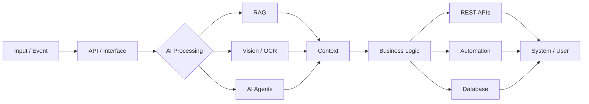

<div align="center">


<br>


<br><br>

<a href="https://bharathabhinesh.me">

</a>
<a href="https://github.com/bharathvk75">

</a>
<a href="https://www.linkedin.com/in/bharathvk75/">

</a>
<a href="mailto:bharathvk75@gmail.com">

</a>

<br><br>


</div>

---

## `> whoami`

```text
Bharath Abhinesh A
AI / ML Engineer
B.Tech CSE — Artificial Intelligence & Machine Learning

Bengaluru, India

I build practical AI systems around:
├── Multi-Agent Systems & MCP
├── Retrieval-Augmented Generation
├── LLM Applications
├── Intelligent Workflow Automation
├── Computer Vision & OCR
├── Backend & REST API Engineering
└── Local / Self-Hosted AI Infrastructure
```

My engineering focus is on taking AI beyond isolated models and turning it into **usable systems** — combining agents, retrieval, APIs, automation, vision pipelines, and backend services into reliable workflows.

---

## ⚡ What I'm Building

<table>
<tr>
<td width="50%" valign="top">

### 🧠 Multi-Agent AI

Designing agent architectures using **LangGraph, MCP, RAG and specialized AI agents**.

```text
User / Event
      ↓
Orchestrator
      ↓
┌─────┼─────┐
↓     ↓     ↓
Agent Agent Agent
↓     ↓     ↓
└─────┼─────┘
      ↓
Structured Output
```

</td>

<td width="50%" valign="top">

### ⚙️ Intelligent Automation

Building automation systems that connect:

```text
Documents
    ↓
OCR / Extraction
    ↓
AI Processing
    ↓
Business Logic
    ↓
REST APIs
    ↓
Automation
    ↓
Human / System Action
```

</td>
</tr>
</table>

---

## 🏢 Industry Experience

### IT Automation Intern — Induspic Engineers

**Bengaluru, India · Dec 2025 – Present**

Working on internal AI-assisted automation and backend workflows for business operations.

* Built a **document-search RAG workflow** using Python, LangChain and vector databases, reducing average information-retrieval time by **49%**.
* Developed an **automated quotation workflow** combining document processing, AI-assisted extraction, approval steps and email automation.
* Developed backend services and **REST API integrations** for internal business workflows.
* Automated repetitive IT and operational processes by connecting AI workflows with existing systems.
* Worked with operational teams to translate workflow requirements into usable internal automation systems.

---

## 🚀 Featured Projects

### 🧠 SYNAPSE — Multi-Agent Code Reviewer

<a href="https://github.com/bharathvk75/SYNAPSE">

</a>

A multi-agent AI code-review platform designed to analyze repositories and pull requests through specialized review agents.

**Highlights**

* Multi-agent orchestration with **LangGraph**
* Specialized analysis for security, maintainability and performance
* GitHub workflow / PR integration
* Parallel agent execution
* Automated structured Markdown reports
* Evaluated across **200+ PR/repository samples**
* **78% issue-detection accuracy** on the defined evaluation set
* Reduced manual review effort by approximately **40%**

**Stack**

`Python` `LangGraph` `AI Agents` `GitHub` `REST APIs` `LLMs`

---

### 💊 DeepXmeD — AI Medicine Discovery Platform

<a href="https://github.com/bharathvk75/DeepXmeD">

</a>

An AI-assisted medicine discovery platform combining prescription OCR, medicine search, pharmacy discovery and price comparison.

**Highlights**

* Prescription image processing and OCR
* Medicine discovery and comparison
* Pharmacy discovery
* AI-assisted responses
* Authentication and search history
* Cloud-backed application workflows
* OCR evaluation across **1,500+ prescription samples**
* Approximately **95% recognition accuracy** on the project evaluation set

**Stack**

`Python` `FastAPI` `OCR` `AI` `Computer Vision` `REST APIs` `PostgreSQL`

---

### 👁 AEGIS — Real-Time Edge Video Analytics

<a href="https://github.com/bharathvk75/AEGIS">

</a>

An edge-AI computer-vision system for real-time object detection and event monitoring.

**Performance**

```text
Inference
39 ms  ───────────────────→  24 ms

Throughput
~40 FPS

Detection Accuracy
~80%
```

Pipeline and inference optimizations reduced average inference latency from **39 ms to 24 ms** while maintaining comparable detection performance.

**Stack**

`Python` `PyTorch` `OpenCV` `Computer Vision` `Docker`

---

## 🧩 Engineering Architecture


```mermaid
flowchart LR

    A[Input / Event] --> B[API / Interface]

    B --> C{AI Processing}

    C --> D[RAG]
    C --> E[Vision / OCR]
    C --> F[AI Agents]

    D --> G[Context]
    E --> G
    F --> G

    G --> H[Business Logic]

    H --> I[REST APIs]
    H --> J[Automation]
    H --> K[Database]

    I --> L[System / User]
    J --> L
    K --> L
```

---

## 🛠️ Technical Stack

### AI / LLM

<p align="center">


</p>

### Backend & APIs

<p align="center">

</p>

### Machine Learning & Vision

<p align="center">

</p>

<p align="center">


</p>

### Engineering

<p align="center">

</p>

---

## 📊 GitHub Activity

<div align="center">


</div>

<br>

<div align="center">


</div>

---

## 📈 Contribution Activity

<div align="center">


</div>

---

## 🎓 Education & Certifications

**Garden City University — Bengaluru**

`B.Tech Computer Science & Engineering (AI & ML)`

**CGPA: 8.6 / 10.0 · Graduated July 2026**

### Selected Certifications

* Model Context Protocol (MCP) Developer — Anthropic
* Building with Claude API — Anthropic
* Deep Agents — LangChain Academy
* TensorFlow: Advanced Techniques Specialization — Imperial College
* Python PCAP — Cisco Networking Academy
* Python Essentials — Cisco Networking Academy
* AWS Solutions Architecture Job Simulation — Forage

---

## 🌐 Let's Connect

<div align="center">

<a href="https://bharathabhinesh.me">

</a>

<a href="https://github.com/bharathvk75">

</a>

<a href="https://www.linkedin.com/in/bharathvk75/">

</a>

<a href="mailto:bharathvk75@gmail.com">

</a>

</div>

<br>

<div align="center">

```text
┌─────────────────────────────────────────────────────────────┐
│                                                             │
│   Building intelligent systems that solve real problems.    │
│                                                             │
└─────────────────────────────────────────────────────────────┘
```


</div>
